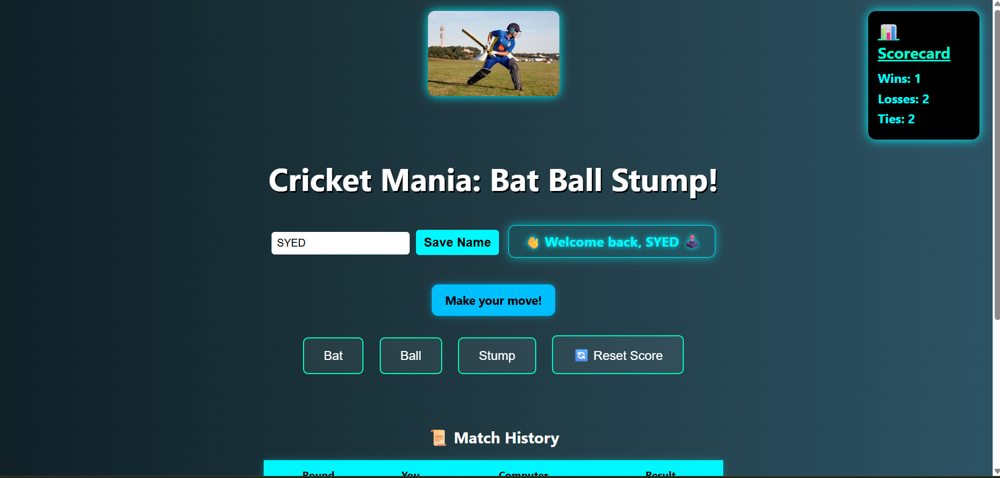

# 🏏 Cricket Mania - Bat Ball Stump!

Cricket Mania is a fun web-based game where you go head-to-head with the computer in a simplified version of cricket using **Bat**, **Ball**, and **Stump**. Think of it like Rock-Paper-Scissors — but with a cricket twist!

---

## 🔥 Features

- 🎮 Single player mode vs computer
- 🏏 Actions: Bat, Ball, Stump
- 📈 Real-time Scorecard (Wins, Losses, Ties)
- 🔊 Game sounds for win/loss/tie
- 💾 Score persistence using `localStorage`
- 🙋 Personalized welcome with player name input
- 🏆 Achievement badges unlocked on performance
- 🎉 Celebratory animations for milestones
- 📱 Responsive and mobile-friendly layout

---

## 🚀 How to Play

1. Enter your name and click **Save Name**
2. Click on **Bat**, **Ball**, or **Stump** to make your move
3. The computer will randomly choose its move
4. The result is shown instantly and score is updated
5. Use the **Reset Score** button to start fresh while keeping achievements

---

## 🧠 Rules

| Your Move | Computer's Move | Result     |
|-----------|------------------|------------|
| Bat       | Ball             | You Win 🏆 |
| Bat       | Stump            | You Lose ❌|
| Ball      | Stump            | You Win 🏆 |
| Ball      | Bat              | You Lose ❌|
| Stump     | Bat              | You Win 🏆 |
| Stump     | Ball             | You Lose ❌|
| Same Move | Same Move        | Tie ⚖️    |

---

## 📁 Project Structure

cricket-mania/
├── sounds/
│   ├── win.mp3
│   ├── lose.mp3
│   └── tie.mp3
├── cricket.css
├── cricket.jpg            # Game banner (used inside game)
├── cricmania.png          # Game screenshot (used in README)
├── index.html
└── README.md

---

## 💻 Technologies Used

- HTML5
- CSS3
- JavaScript 
- Web Audio API
- LocalStorage

---

## 📸 Game Preview

---

## 📦 How to Run

1. Clone or download this repo  
2. Make sure the `sounds/` folder and `cricket.jpg` are in the same directory as `index.html`  
3. Open `index.html` in any modern web browser  
4. Play & enjoy! 🏏🔥

---

## 🙌 Credits

Made with ❤️ by Syed Mohd Kashif Rizvi  
All icons, images, and sounds used are for educational/demo purposes.

---

## 📬 Feedback or Suggestions?

Feel free to drop suggestions or ideas to improve the game! where to write this 
